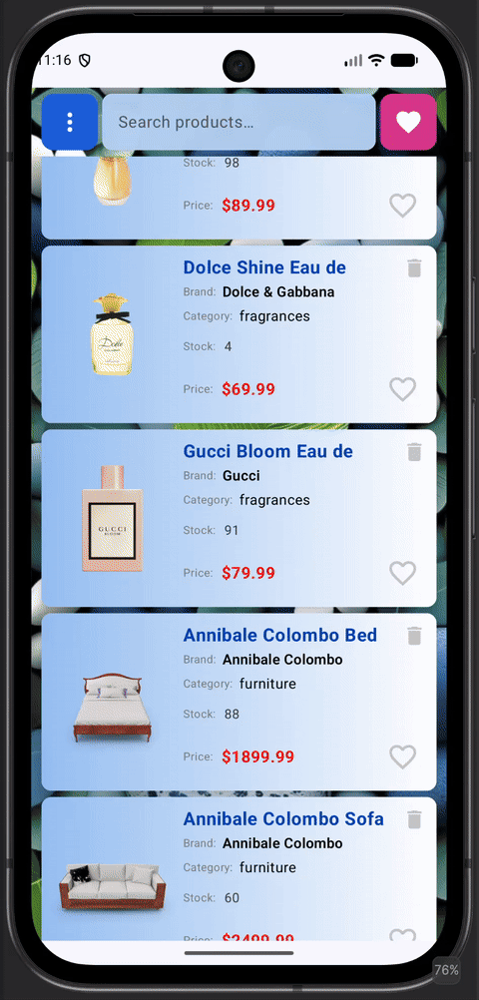
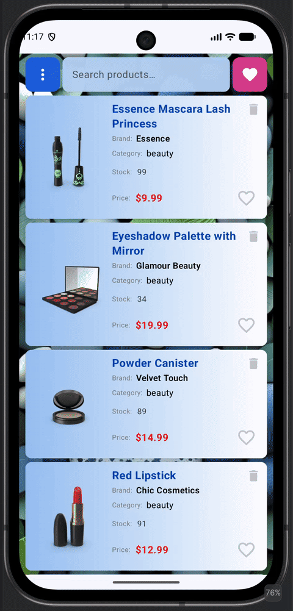
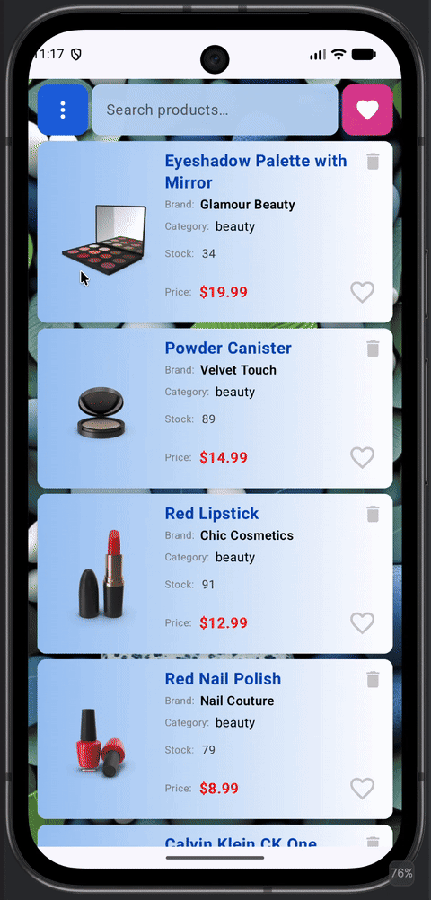

# App_Retrofit2
# 📱 Offline-First Product Catalog

A modern Android application built with **Kotlin and Jetpack Compose**, demonstrating a production-oriented approach to **offline-first data loading, pagination, local caching, and network synchronization**.

The project focuses on building a reliable data layer where the local **Room database serves as the single source of truth**, while **Paging 3 and RemoteMediator** coordinate data loading from a remote API.

## ✨ Features

* 📦 Browse products by category
* 🔄 Offline-first data access
* 📄 Paginated product loading with Paging 3
* 🌐 Remote data synchronization
* 💾 Local caching with Room
* 🔁 RemoteMediator for network/database coordination
* 🔍 Product search with pagination
* ⚡ Reactive UI with Kotlin Coroutines and Flow
* 🎨 Modern UI built with Jetpack Compose
* 🧪 Unit testing with JUnit and Mockito

## 📱 App Demo

<p align="left">
  
  
  
</p>

## 🏗️ Architecture

The application follows **Clean Architecture** and **MVVM**, with a clear separation between presentation, domain, and data layers.

```text
┌─────────────────────────────┐
│             UI              │
│       Jetpack Compose       │
└──────────────┬──────────────┘
               │
               ▼
┌─────────────────────────────┐
│         ViewModel           │
│       State / Flow          │
└──────────────┬──────────────┘
               │
               ▼
┌─────────────────────────────┐
│           Domain            │
│     Use Cases / Models      │
└──────────────┬──────────────┘
               │
               ▼
┌─────────────────────────────┐
│           Data              │
│       Repository            │
└──────────────┬──────────────┘
               │
          ┌────┴─────┐
          ▼          ▼
┌──────────────┐ ┌──────────────┐
│   Remote     │ │    Local     │
│   Retrofit   │ │     Room     │
│   REST API   │ │    Cache     │
└──────┬───────┘ └──────┬───────┘
       │                ▲
       └───────┬────────┘
               ▼
       ┌───────────────┐
       │ RemoteMediator│
       └───────────────┘
```

## 🔄 Paging & RemoteMediator

A key part of the project is the implementation of **Paging 3 with RemoteMediator**.

`RemoteMediator` coordinates network requests with the local Room database, allowing the application to load remote data while keeping the local cache synchronized.

The data flow is:

```text
Remote API
    │
    ▼
RemoteMediator
    │
    ▼
Room Database
    │
    ▼
Paging 3
    │
    ▼
ViewModel
    │
    ▼
Jetpack Compose UI
```

The database acts as the **single source of truth** for the UI.

This approach provides:

* cached data when the device is offline;
* incremental loading of large datasets;
* persistent local data;
* controlled cache refresh;
* synchronization between remote and local data;
* reactive updates through Kotlin Flow.

## 💾 Local Database

**Room** is used as the local persistence layer.

The database stores products and categories using separate entities, with a cross-reference table for product/category relationships.

Related database operations are performed inside a transaction to keep the cache consistent:

```kotlin
database.withTransaction {
    productDao.clear()
    categoryDao.clear()
    crossRefDao.clear()

    categoryDao.insert(categories)
    productDao.insert(products)
    crossRefDao.insert(crossRefs)
}
```

This ensures that related data is updated atomically rather than leaving the database in a partially updated state.

## 🔍 Product Search

The application supports product search using a dedicated paging data source.

Search results are loaded incrementally from the remote API and exposed through the Paging library, allowing the application to efficiently handle larger result sets.

## 🧪 Testing

The project includes unit tests using **JUnit and Mockito**.

Tests are designed to verify application logic while isolating components from external dependencies.

Testing includes key areas such as:

* Repository and data-layer logic
* ViewModel behavior
* Paging-related logic
* RemoteMediator behavior
* Success and error scenarios
* Dependency interactions using Mockito

The architecture is designed to keep business and data logic **testable, isolated, and maintainable**.

## 🧰 Tech Stack

### Android

* Kotlin
* Android SDK
* Jetpack Compose
* Material 3
* Kotlin Coroutines
* Kotlin Flow

### Architecture

* Clean Architecture
* MVVM
* Repository Pattern
* Dependency Injection

### Data

* Room
* Paging 3
* RemoteMediator
* Retrofit
* REST API
* Local caching

### Dependency Injection

* Hilt

### Testing

* JUnit
* Mockito

## 📂 Project Structure

```text
app/
├── data/
│   ├── local/
│   │   ├── dao/
│   │   ├── entity/
│   │   └── database/
│   │
│   ├── remote/
│   │   ├── api/
│   │   └── dto/
│   │
│   ├── mediator/
│   └── repository/
│
├── domain/
│   ├── model/
│   ├── repository/
│   └── usecase/
│
└── presentation/
    ├── screen/
    ├── components/
    └── viewmodel/
```

## 🧠 Engineering Highlights

### Single Source of Truth

The UI consumes data from the local Room database instead of directly depending on network responses.

### Offline-First Design

Previously loaded data remains available when the network is unavailable, providing a more resilient user experience.

### Pagination

Paging 3 enables efficient incremental loading without loading the entire dataset into memory.

### Network & Database Synchronization

RemoteMediator coordinates API requests and local persistence, keeping paginated data synchronized with the local cache.

### Atomic Database Updates

Room transactions ensure that products, categories, and their relationships are updated consistently.

### Reactive Data Flow

Kotlin Flow provides reactive data propagation from the database through the repository and ViewModel to the Compose UI.

### Testable Architecture

Clean separation of responsibilities allows core application logic to be tested independently using JUnit and Mockito.

## 📸 Screenshots

*Add screenshots of the application here.*

## 🚀 Getting Started

### Requirements

* Android Studio
* JDK 17+
* Android SDK
* Internet connection for initial data synchronization

### Installation

1. Clone the repository.
2. Open the project in Android Studio.
3. Sync Gradle dependencies.
4. Run the application on an emulator or physical Android device.

## 🔮 Future Improvements

* Enhanced cache expiration policies
* Improved retry and error handling
* Expanded automated test coverage
* Compose UI tests
* Advanced search and filtering
* Network connectivity monitoring
* Improved loading and empty states

## 👩‍💻 About

This project demonstrates modern Android development practices with a focus on **reliable data handling, scalable architecture, offline-first design, and testability**.

Built with:

**Kotlin · Jetpack Compose · Room · Paging 3 · RemoteMediator · Retrofit · Coroutines · Flow · Hilt · JUnit · Mockito**

